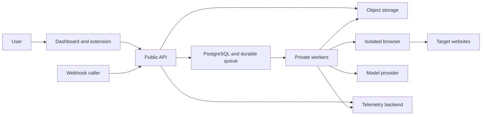

## Executive summary

DoOnce is assumed to be an internet-facing, multi-tenant SaaS whose highest risks are cross-tenant access, theft or misuse of browser-session credentials, malicious workflow execution, and leakage through uploaded video or run artifacts. The design already uses signed server sessions, tenant-scoped database transactions, role checks, strict workflow schemas, signed webhooks, and bounded file paths; production readiness still depends on managed secret encryption, private worker networking, object-storage controls, and continuous authorization and abuse monitoring.

## Scope and assumptions

- In scope: the backend runtime under `src/`, database migrations under `database/migrations/`, runtime container configuration, and production CI/release controls in `.github/workflows/ci.yml`.
- Supporting client surface: the paired browser extension and dashboard in `../Frontend`, specifically extension capture/execution, cookie-authenticated dashboard calls, and production response headers.
- Runtime assumption: public multi-tenant SaaS behind TLS ingress; API nodes are public, while PostgreSQL, queue workers, hosted browsers, telemetry, and object storage are private services.
- Data assumption: beta use is restricted to ordinary business data. Regulated healthcare, financial, government, and similarly sensitive workloads are not approved without another review.
- Secret assumption: production uses a managed secrets service and KMS; local environment variables and filesystem storage are development-only (`src/hosted/secret-provider.ts`, `src/artifacts/filesystem-object-store.ts`).
- The user did not correct the recommended assumptions after the required check-in, so risk rankings that depend on deployment or data sensitivity remain conditional.

Out of scope are vulnerabilities inside third-party websites being automated, cloud-provider control planes, browser and model-provider internals, developer workstations, and physical attacks. A self-hosted or regulated deployment would require a separate assessment.

Open questions that could materially change ranking are the eventual tenant count and run concurrency, whether customer-managed encryption keys are required, and whether regulated data will later be permitted.

## System model

### Primary components

- The Next.js dashboard and Chrome extension collect user instructions, demonstrations, workflow edits, and run commands (`../Frontend/app/features/workflows/`, `../Frontend/extension/src/`).
- The Fastify API authenticates users, validates origins and schemas, applies role checks, and routes workflow, capture, run, artifact, scheduling, trigger, repair, and video requests (`src/server.ts`, `src/contracts/validation.ts`).
- PostgreSQL stores tenant-owned definitions and durable operational state. Tenant context is installed per transaction and the runtime role is checked against row-level-security bypass (`src/database/tenant-context.ts`, `src/database/runtime-role.ts`).
- pg-boss workers execute durable authoring, cleanup, scheduling, repair, and video jobs (`src/queue/pg-boss-job-queue.ts`, `src/queue/workers.ts`).
- The extension executor and hosted Playwright executor interact with target websites (`../Frontend/extension/src/runtime/`, `src/hosted/playwright-executor.ts`).
- Artifact/video storage retains bounded binary evidence separately from WorkflowSpec (`src/artifacts/artifact-service.ts`, `src/video/resumable-video-store.ts`).
- External model providers receive bounded authoring or repair prompts through provider interfaces (`src/authoring/authoring-provider.ts`, `src/repair/repair-provider.ts`).

### Data flows and trust boundaries

- Internet user -> Dashboard/extension -> API: credentials, text, workflow definitions, capture events, video chunks, and run commands cross HTTPS. Signed HttpOnly sessions or one-time extension pairing authenticate calls; origin checks, rate limits, role checks, size bounds, and strict schemas constrain input (`src/server.ts`, `src/auth/session-token.ts`, `src/capture/capture-service.ts`).
- API/worker -> PostgreSQL: tenant-owned state and job metadata cross a private PostgreSQL connection. Parameterized SQL, transaction-local tenant/user settings, row-level security, and a non-bypass runtime-role assertion protect isolation (`src/database/tenant-context.ts`, `src/database/runtime-role.ts`).
- API/worker -> object storage: videos and artifacts cross a private storage channel. IDs, content types, offsets, sizes, checksums, expiry, and path containment are validated; production encryption and managed storage are deployment requirements (`src/video/video-service.ts`, `src/artifacts/filesystem-object-store.ts`).
- API -> queue -> worker: authenticated job payloads cross durable PostgreSQL-backed queues. Idempotency, bounded retries, job identifiers, and tenant context limit replay and duplication (`src/queue/pg-boss-job-queue.ts`, `src/queue/workers.ts`).
- Worker -> target website: workflow actions and secret values cross HTTPS in an isolated browser. Action capability checks, semantic locators, verification, and pause behavior constrain execution (`src/execution/action-capabilities.ts`, `src/hosted/playwright-executor.ts`).
- API/worker -> model provider: task text and bounded evidence cross provider HTTPS. Provider adapters validate structured output, but contractual retention and redaction remain operational dependencies (`src/authoring/structured-model-authoring-provider.ts`, `src/authoring/authoring-normalizer.ts`).
- External trigger -> webhook API: inputs, timestamp, idempotency key, and signature cross HTTPS. Timestamp validation, HMAC verification, canonical input, and receipt uniqueness prevent unauthenticated and replayed runs (`src/triggers/webhook-service.ts`, `src/triggers/postgres-webhook-store.ts`).

#### Diagram

## Assets and security objectives

| Asset | Why it matters | Security objective (C/I/A) |
|---|---|---|
| Tenant workflows and versions | Control what browsers do and provide business automation value | C/I/A |
| Session profiles and secret references | Can grant authenticated access to target websites | C/I |
| Session and extension tokens | Impersonation enables cross-user actions | C/I |
| Videos, artifacts, and run outputs | May contain customer business data or screenshots | C/I/A |
| Run, queue, and schedule state | Duplicate or modified state can cause unintended actions | I/A |
| Audit, metrics, and trace data | Required for investigation without becoming a leak channel | C/I/A |
| Database and signing/encryption keys | Compromise defeats tenant and message boundaries | C/I/A |
| Release images, extension bundles, and SBOM | Supply-chain integrity governs all deployed code | I/A |

## Attacker model

### Capabilities

- An unauthenticated remote attacker can reach public authentication, health, webhook, and other intentionally public endpoints.
- An authenticated tenant member can submit malformed workflows, capture data, videos, URLs, inputs, and repeated API requests within their role.
- A malicious website can manipulate DOM content observed by the extension or hosted browser and attempt locator confusion or data capture.
- A stolen webhook secret, browser-session credential, session cookie, or extension token can be replayed until revoked or expired.
- A compromised model provider can return adversarial structured output or retain submitted prompt data.

### Non-capabilities

- The attacker is not assumed to control private service networking, cloud KMS, CI administrators, or the production database role without a separate compromise.
- The attacker cannot directly modify signed release artifacts or repository-protected branches under the stated deployment model.
- Vulnerabilities in third-party target websites and cloud-provider internals are not attributed to DoOnce, though their outputs remain untrusted.

## Entry points and attack surfaces

| Surface | How reached | Trust boundary | Notes | Evidence (repo path / symbol) |
|---|---|---|---|---|
| Authentication/session APIs | Public HTTPS | Internet -> API | Password verification, signed session, revocation, and rate limits | `src/auth/auth-service.ts` / `AuthService`; `src/server.ts` / `buildServer` |
| Workflow and run APIs | Authenticated HTTPS | Tenant client -> API | Role checks and schema validation protect integrity | `src/workflow/workflow-service.ts`; `src/runner/run-service.ts` |
| Extension pairing and sync | HTTPS with pairing/token | Browser extension -> API | One-time pairing and bounded contiguous batches | `src/capture/capture-service.ts` |
| Video/artifact upload and download | Authenticated binary HTTPS | Tenant client -> storage | Size, offset, checksum, UUID, retention, and signed grant controls | `src/video/video-service.ts`; `src/artifacts/artifact-service.ts` |
| Webhook trigger | Public signed HTTPS | External caller -> API | HMAC, timestamp, canonical body, idempotency receipt | `src/triggers/webhook-service.ts` / `trigger` |
| Durable jobs | Private PostgreSQL queue | API -> worker | Retry and restart can amplify non-idempotent handlers | `src/queue/workers.ts`; `src/queue/pg-boss-job-queue.ts` |
| Hosted/extension browser execution | Workflow interpreter | Worker/extension -> website | DOM and downloaded content are attacker-influenced | `src/hosted/playwright-executor.ts`; `../Frontend/extension/src/runtime/` |
| Model authoring and repair | Provider HTTPS | Worker -> third party | Prompt privacy and adversarial output are material | `src/authoring/structured-model-authoring-provider.ts`; `src/repair/repair-provider.ts` |
| Metrics and logs | Private scrape/export | Runtime -> operators | Must remain private and avoid raw customer values | `src/observability/metrics.ts`; `src/observability/tracing.ts` |
| CI and release containers | GitHub Actions | Developer repo -> registry | Dependency, image, and SBOM integrity | `.github/workflows/ci.yml`; `Dockerfile` |

## Top abuse paths

1. Cross-tenant access: attacker obtains a valid low-privilege account -> supplies another tenant's resource UUID -> a missing tenant transaction or RLS policy returns data -> workflows or artifacts are disclosed.
2. Session theft: attacker obtains a browser-session secret reference or underlying credential -> starts a hosted run -> accesses a customer's authenticated target site -> extracts business data.
3. Workflow integrity attack: malicious builder submits a crafted workflow -> validation or action classification is bypassed -> hosted browser performs an unintended write -> target-site data changes.
4. Artifact exfiltration: attacker guesses or receives an artifact grant -> exploits excessive lifetime or missing tenant binding -> downloads video, screenshots, or output belonging to another run.
5. Webhook replay: attacker captures a valid signed request -> retries it with an accepted timestamp/idempotency variation -> duplicate production runs create repeated effects.
6. DOM deception: malicious target page presents ambiguous or adversarial elements -> locator selects the wrong element -> workflow exposes a secret or performs the wrong action before verification catches it.
7. Resource exhaustion: authenticated attacker sends large video chunks, authoring jobs, or run requests -> queue/storage/hosted browsers saturate -> other tenants lose availability.
8. Prompt leakage: workflow input or captured evidence includes a secret -> redaction boundary fails -> a third-party model or telemetry backend receives sensitive data.

## Threat model table

| Threat ID | Threat source | Prerequisites | Threat action | Impact | Impacted assets | Existing controls (evidence) | Gaps | Recommended mitigations | Detection ideas | Likelihood | Impact severity | Priority |
|---|---|---|---|---|---|---|---|---|---|---|---|---|
| TM-001 | Authenticated tenant attacker | A tenant-scoped query or RLS policy is absent or the runtime role can bypass RLS. | Request another tenant's UUID through an authenticated endpoint. | Cross-tenant disclosure or mutation. | Workflows, runs, artifacts, sessions | Transaction-local tenant/user context and runtime-role assertion (`src/database/tenant-context.ts`, `src/database/runtime-role.ts`) | New resources can omit policy coverage. | Require migration-level RLS tests and an authorization matrix test for every tenant-owned route; fail startup on BYPASSRLS/superuser. | Alert on tenant-context failures and repeated not-found UUID probing. | medium | high | high |
| TM-002 | Token thief or malicious operator | Session, extension, webhook, or browser credential is exposed. | Reuse credential to impersonate a user or execute authenticated browser work. | Account takeover and target-site data access. | Tokens, sessions, secret references | HMAC sessions, hashed server session records, revocation, role checks (`src/auth/session-token.ts`, `src/auth/postgres-auth-store.ts`) | Rotation and managed encryption depend on deployment. | Store secrets only in managed KMS-backed service, use short TTLs, rotation, audience binding, revocation UI, and private worker identity. | Alert on new geography, pairing spikes, secret resolution failures, and unusual hosted-run volume. | medium | high | high |
| TM-003 | Malicious builder or compromised model | Ability to author or repair a workflow. | Encode unsafe navigation/action semantics or adversarial structured output. | Unintended browser actions or data exposure. | Workflow integrity, target-site data | Strict WorkflowSpec, domain allowlist, capability policy, immutable publication (`src/workflow/workflow-spec.ts`, `src/execution/action-capabilities.ts`) | Browser behavior and target content remain dynamic. | Keep deterministic validation authoritative; require test evidence for publication; isolate hosted sessions; preserve explicit approval for newly supported write actions. | Track policy rejection, verification failure, repair acceptance, and unexpected domain attempts. | medium | high | high |
| TM-004 | Remote or authenticated attacker | Upload/download limits or grant binding are incomplete. | Exhaust storage/parser resources or retrieve another tenant's binary. | Availability loss or business-data disclosure. | Videos, artifacts, storage | Size/offset/checksum/UUID/path bounds and retention (`src/video/video-service.ts`, `src/artifacts/filesystem-object-store.ts`) | Local store is not a production authorization boundary; media tools expand parser surface. | Use private managed object storage, tenant-scoped object keys, short signed URLs, malware/media sandboxing, quotas, and lifecycle policies. | Alert on quota pressure, rejected offsets, checksum failures, and high download-grant issuance. | medium | high | high |
| TM-005 | Signed webhook caller or captured request | Valid signing secret and timestamp window. | Replay or vary an otherwise valid trigger to duplicate effects. | Duplicate runs and unintended target-site operations. | Run and queue integrity | Timestamp, HMAC, receipt uniqueness, run idempotency (`src/triggers/webhook-service.ts`, `src/triggers/postgres-webhook-store.ts`) | Secret rotation and caller clock handling are operational. | Add dual-key rotation, per-endpoint rate limits, bounded timestamp window tests, and retain replay receipts through the maximum retry window. | Alert on duplicate receipts, signature failures, and endpoint-specific run spikes. | low | high | medium |
| TM-006 | Malicious target website | Workflow visits attacker-influenced content. | Manipulate DOM or downloads to confuse semantic locators or capture secrets. | Incorrect actions or sensitive-data exposure. | Browser session, secret inputs, run integrity | Confidence ordering, ambiguity pause, outcome assertions (`../Frontend/extension/src/runtime/`, `src/hosted/playwright-executor.ts`) | Browser isolation policy and egress restrictions are deployment controls. | One ephemeral browser context per run, destination allowlist enforcement on every navigation, download quarantine, blocked local/private network egress, and secret-field destination checks. | Alert on domain drift, ambiguity, blocked egress, unexpected downloads, and secret-input pauses. | medium | high | high |
| TM-007 | Authenticated abusive tenant | Valid account and accepted large/repeated operations. | Saturate queues, browser slots, model budgets, or storage. | Multi-tenant availability and cost impact. | API, queues, workers, storage | Route rate limits, bounded payloads, queue metrics, quotas in authoring (`src/server.ts`, `src/authoring/authoring-service.ts`) | Per-tenant budgets are not uniformly proven across every job type. | Enforce tenant concurrency, storage, video, model-cost, and scheduled-run quotas at admission; add backpressure and circuit breakers. | Queue-age, tenant job volume, model cost, storage growth, and 429/503 alerts. | medium | medium | medium |
| TM-008 | Customer input or provider | Sensitive value reaches a prompt, log, trace, screenshot, or support bundle. | Cause raw value to be retained outside its intended system. | Confidentiality breach and third-party retention. | Inputs, artifacts, telemetry | Secret flags, redacted receipts, structured stable-code telemetry (`src/workflow/canonical-workflow-service.ts`, `src/observability/tracing.ts`) | Semantic secrets can be mislabeled; provider contracts are external. | Centralize value-aware redaction, prohibit request bodies in telemetry, scan fixtures/support exports, use provider zero-retention terms, and document artifact consent. | Canary-secret tests, DLP sampling, redaction counters, and support-export audit logs. | medium | high | high |
| TM-009 | Supply-chain attacker | Compromised dependency, action, container base, or extension release process. | Inject code into API, worker, dashboard, or extension artifacts. | Full service or browser compromise. | Release artifacts, credentials, tenant data | Locked dependencies, audit, SBOM, image scan, non-root images (`.github/workflows/ci.yml`, `Dockerfile`) | Actions and images are tag-pinned rather than immutable digest/SHA in some locations. | Pin third-party actions and base images by digest, sign images and extension bundles, protect environments, and verify provenance before deployment. | Dependency-diff review, signature verification failures, and registry provenance alerts. | low | high | medium |

## Criticality calibration

- **Critical:** realistic pre-auth compromise of API/worker execution, broad authentication bypass, or systemic cross-tenant extraction. Examples: forged sessions accepted for any tenant; public upload leading to worker remote-code execution; production KMS/root database key theft.
- **High:** material tenant compromise requiring an account, stolen credential, or reachable workflow boundary. Examples: one-tenant artifact exfiltration; hosted-browser credential misuse; workflow validation bypass causing unintended writes.
- **Medium:** targeted availability/cost impact or attacks substantially constrained by existing controls. Examples: per-tenant queue exhaustion; webhook replay within a narrow window; supply-chain compromise requiring protected release access.
- **Low:** low-sensitivity metadata disclosure or noisy failures with easy containment. Examples: disclosure of public capability flags; isolated malformed input causing a single rejected job; non-sensitive health timing variation.

## Focus paths for security review

| Path | Why it matters | Related Threat IDs |
|---|---|---|
| `src/server.ts` | Central public route, auth, origin, rate-limit, upload, and error boundary | TM-001, TM-002, TM-004, TM-007 |
| `src/database/tenant-context.ts` | Installs tenant/user context used by RLS-protected queries | TM-001 |
| `src/database/runtime-role.ts` | Prevents deployment with an RLS-bypassing role | TM-001 |
| `database/migrations/` | Defines RLS coverage, constraints, replay receipts, and retention state | TM-001, TM-005 |
| `src/auth/` | Session signing, password verification, persistence, and revocation | TM-002 |
| `src/capture/capture-service.ts` | Extension pairing and attacker-influenced event ingestion | TM-002, TM-007, TM-008 |
| `src/workflow/workflow-spec.ts` | Canonical validation boundary for executable behavior | TM-003 |
| `src/execution/action-capabilities.ts` | Decides which browser actions may execute or must pause | TM-003, TM-006 |
| `src/hosted/playwright-executor.ts` | Privileged browser/network boundary using session secrets | TM-002, TM-006 |
| `src/artifacts/` | Binary authorization, grants, retention, checksum, and storage paths | TM-004, TM-008 |
| `src/video/` | Large untrusted uploads and media-parser invocation | TM-004, TM-007, TM-008 |
| `src/triggers/` | Public HMAC webhook and replay/idempotency boundary | TM-005 |
| `src/authoring/` | Third-party model prompts and structured output validation | TM-003, TM-008 |
| `src/repair/` | Failure evidence passed to deterministic/model repair logic | TM-003, TM-008 |
| `src/queue/` | Durable retries, tenant context, concurrency, and restart behavior | TM-005, TM-007 |
| `src/observability/` | Telemetry privacy and incident detection | TM-007, TM-008 |
| `.github/workflows/ci.yml` | Release supply-chain checks and recovery gate | TM-009 |
| `Dockerfile` | Runtime package, browser/media parser, and privilege surface | TM-004, TM-006, TM-009 |
| `../Frontend/extension/src/runtime/` | Executes workflows in the user's authenticated browser | TM-002, TM-003, TM-006 |
| `../Frontend/next.config.ts` | Dashboard browser security headers and API connection policy | TM-002, TM-008 |

## Notes on use

- Entry points, trust boundaries, runtime versus CI scope, and the user's non-response to the assumption check are explicitly represented above.
- Risk priorities assume ordinary business data and a private managed production data plane; permitting regulated data or exposing workers/storage publicly increases TM-002, TM-004, TM-006, and TM-008.
- This model should be updated when a new browser action, upload parser, credential type, runtime, connector, or deployment model passes the Phase 13 expansion gate.
